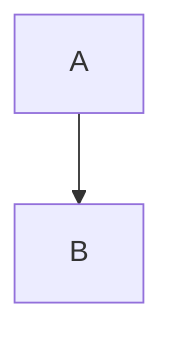

# Document Template Usage Guide

This guide explains how to use the migration documentation templates and integrate them with the documentation generation tool.

## Template Overview

All templates are written in **Handlebars** format (`.hbs`) and follow a consistent structure:

1. **Document Information**: Metadata header with project details
2. **Executive Summary**: High-level overview
3. **Structured Sections**: Domain-specific content areas
4. **Appendices**: Supporting information
5. **Document History**: Version tracking

## Available Templates

### 1. As-Is Analysis (`as-is-analysis.hbs`)

**Purpose:** Document the current state of the system before migration

**Key Sections:**
- System Overview
- Source Code Analysis (LOC, complexity, dependencies)
- Database Analysis (schema, data volume)
- Complexity & Quality Assessment
- Risk Assessment

**Primary Data Sources:**
- COBOL/PL1 source code analysis
- Oracle/MySQL DDL parsing
- Metadata extraction (LOC, complexity metrics)
- Dependency analysis

**AI Enhancement Opportunities:**
- Business logic descriptions
- Migration challenge identification
- Risk assessment elaboration

**Sample Usage:**
```javascript
const template = loadTemplate('as-is-analysis.hbs');
const data = {
  project: {
    name: "Customer Management System",
    migration_type: "COBOL-to-Java"
  },
  metadata: {
    source_analysis: {
      total_files: 145,
      total_loc: 125000,
      programs: [/* analyzed programs */]
    },
    database: {
      tables: 45,
      views: 12
    }
  }
};
const document = template(data);
```

---

### 2. Migration Strategy (`migration-strategy.hbs`)

**Purpose:** Define the overall approach and plan for migration

**Key Sections:**
- Migration Overview (current → target state)
- Migration Approach (big bang vs phased)
- Code & Database Migration Strategy
- Testing Strategy Summary
- Risk Management
- Resource Planning

**Primary Data Sources:**
- Project configuration
- Metadata from As-Is Analysis
- Knowledge base (migration patterns, best practices)
- Manual inputs (objectives, timeline)

**AI Enhancement Opportunities:**
- Migration approach recommendations based on project size/complexity
- Risk identification and mitigation strategies
- Effort estimation

**Sample Usage:**
```javascript
const data = {
  strategy: {
    approach: "Phased Migration",
    rationale: "Reduced risk, incremental value delivery"
  },
  mappings: {
    code: [
      { source: "COBOL Program", target: "Java Class", notes: "1:1 mapping" }
    ]
  }
};
```

---

### 3. Migration Design (`migration-design.hbs`)

**Purpose:** Provide detailed technical design for code and database migration

**Key Sections:**
- Architecture Design (target architecture, patterns)
- Code Migration Design (package structure, component mapping)
- Database Design (schema, DDL, stored procedures)
- Data Migration Design (transformation rules, validation)
- Performance Optimization
- Security Design

**Primary Data Sources:**
- Source code analysis (COBOL/PL1 → Java mapping)
- DDL analysis (Oracle → PostgreSQL schema mapping)
- Knowledge base (design patterns, data type conversions)
- Manual inputs (API design, configuration)

**AI Enhancement Opportunities:**
- Component mapping suggestions
- Code snippet generation (interface definitions)
- Data transformation rule creation

**Sample Usage:**
```javascript
const data = {
  architecture: {
    diagram: "graph TB\n  UI --> API\n  API --> Service...",
    patterns: [
      { name: "Repository Pattern", description: "...", usage: "Data access" }
    ]
  },
  code_design: {
    package_structure: "src/main/java/...",
    components: [/* component details */]
  },
  db_design: {
    tables: [/* table definitions */],
    type_conversions: [/* type mappings */]
  }
};
```

---

### 4. Test Strategy (`test-strategy.hbs`)

**Purpose:** Define comprehensive testing approach

**Key Sections:**
- Test Levels (unit, integration, system, migration, performance, UAT)
- Test Environment & Data Management
- Test Automation Strategy
- Defect Management
- Entry/Exit Criteria
- Test Schedule

**Primary Data Sources:**
- Metadata from As-Is Analysis (test coverage areas)
- Manual inputs (test scenarios, environments, resources)
- Knowledge base (testing best practices)

**AI Enhancement Opportunities:**
- Test case generation based on code analysis
- Test data requirements
- Performance baseline recommendations

**Sample Usage:**
```javascript
const data = {
  test_levels: {
    unit: {
      framework: "JUnit 5, Mockito",
      coverage: "80%+"
    },
    migration: {
      data_validation: [
        { check: "Row Count", description: "Compare source vs target" }
      ]
    }
  }
};
```

---

### 5. Deployment & Rollback (`deployment-rollback.hbs`)

**Purpose:** Document deployment procedures and rollback plan

**Key Sections:**
- Deployment Overview (scope, timeline, team)
- Pre-Deployment Checklist
- Detailed Deployment Steps (with scripts)
- Post-Deployment Validation
- Rollback Plan (decision criteria, procedures)
- Hypercare & Monitoring
- Communication Plan

**Primary Data Sources:**
- Application and database versions
- Environment configuration
- Manual inputs (deployment scripts, contacts, timeline)

**AI Enhancement Opportunities:**
- Deployment script generation
- Monitoring metric recommendations
- Incident response procedure generation

**Sample Usage:**
```javascript
const data = {
  deployment: {
    approach: "Blue-Green Deployment",
    steps: {
      db_migration: "psql -h prod-db -f schema.sql",
      app_deployment: "scp target/app.jar prod:/opt/app/"
    }
  },
  rollback: {
    criteria: [/* rollback conditions */]
  }
};
```

---

## Template Variables Reference

### Common Variables (All Templates)

```javascript
{
  // Project metadata
  project: {
    name: string,              // e.g., "Customer Management System"
    migration_type: string     // e.g., "COBOL-to-Java", "Oracle-to-PostgreSQL"
  },

  // Source system
  source: {
    language: string,          // e.g., "COBOL", "PL/I"
    database: string,          // e.g., "Oracle 11g"
    app_server: string,        // e.g., "WebSphere"
    os: string                 // e.g., "z/OS"
  },

  // Target system
  target: {
    language: string,          // e.g., "Java 17"
    framework: string,         // e.g., "Spring Boot 3.x"
    database: string,          // e.g., "PostgreSQL 15"
    deployment: string         // e.g., "Docker/Kubernetes"
  },

  // Document metadata
  generated_date: string,      // ISO date
  version: string,             // e.g., "1.0"
  author: string               // e.g., "Auto-generated"
}
```

### Analysis-Specific Variables

```javascript
{
  metadata: {
    source_analysis: {
      total_files: number,
      total_loc: number,
      programs: [
        {
          name: string,
          path: string,
          loc: number,
          complexity: number,
          dependencies: string[]
        }
      ],
      database: {
        tables: number,
        views: number,
        stored_procedures: number
      }
    },

    complexity: {
      avg_cyclomatic: number,
      max_cyclomatic: number,
      high_complexity_modules: [
        {
          name: string,
          score: number,
          risk: "low" | "medium" | "high"
        }
      ]
    },

    risks: [
      {
        id: string,
        category: string,
        description: string,
        severity: "low" | "medium" | "high" | "critical",
        mitigation: string
      }
    ]
  }
}
```

### Mapping Variables

```javascript
{
  mappings: {
    code: [
      {
        source: string,        // e.g., "CUSTMGMT.cbl"
        target: string,        // e.g., "CustomerService.java"
        type: string,          // e.g., "1:1", "1:N", "N:1"
        notes: string
      }
    ],

    database: [
      {
        source: string,        // e.g., "NUMBER(10,2)"
        target: string,        // e.g., "NUMERIC(10,2)"
        rule: string,          // e.g., "Direct mapping"
        risk: "low" | "medium" | "high"
      }
    ]
  }
}
```

---

## AI Prompt Templates

When using AI (Claude/GPT) to enhance document sections, use these prompt templates:

### 1. Business Logic Description

```
Given the following COBOL source code:

[CODE]

Please describe the business logic in clear, concise language suitable for a migration analysis document. Focus on:
1. What business process this code implements
2. Key business rules and validations
3. Critical data transformations
4. Integration points with other systems

Keep the description to 2-3 paragraphs.
```

### 2. Migration Risk Assessment

```
Analyze the following source code characteristics:
- Total LOC: [NUMBER]
- Complexity (average): [NUMBER]
- High complexity modules: [LIST]
- Database dependencies: [LIST]
- External integrations: [LIST]

Identify potential migration risks and suggest mitigation strategies. Format as:
- Risk: [description]
- Severity: [low/medium/high/critical]
- Impact: [description]
- Mitigation: [strategy]
```

### 3. Test Case Generation

```
Based on this code/functionality:

[CODE or DESCRIPTION]

Generate test cases covering:
1. Happy path scenarios
2. Edge cases
3. Error handling
4. Integration points

Format as:
- Test Case ID
- Description
- Preconditions
- Steps
- Expected Result
```

### 4. Deployment Script Generation

```
Generate a deployment script for:
- Source: [COBOL/Oracle]
- Target: [Java/PostgreSQL]
- Deployment strategy: [Blue-Green/Canary/etc]

Include:
1. Pre-deployment checks
2. Database migration
3. Application deployment
4. Health checks
5. Rollback procedure

Use bash scripting.
```

---

## Handlebars Helper Functions

The template engine should provide these custom helpers:

```javascript
// Format date
{{formatDate generated_date "YYYY-MM-DD"}}

// Conditional rendering
{{#if metadata.risks}}
  [render risks]
{{else}}
  *[No risks identified]*
{{/if}}

// Loop with index
{{#each programs}}
  {{@index}}. {{this.name}}
{{/each}}

// Math operations
{{add metadata.tables metadata.views}} // Total DB objects

// Percentage calculation
{{percentage this.count total}} // Calculate percentage

// Complexity level (custom)
{{complexityLevel this.cyclomatic}} // Returns "Low", "Medium", "High"
```

---

## Integration with Backend

### Step 1: Load Template

```typescript
import Handlebars from 'handlebars';
import fs from 'fs';

const templateSource = fs.readFileSync('templates/as-is-analysis.hbs', 'utf8');
const template = Handlebars.compile(templateSource);
```

### Step 2: Prepare Data

```typescript
const data = {
  project: await getProjectConfig(projectId),
  source: await getSourceInfo(projectId),
  target: await getTargetInfo(projectId),
  metadata: await getAnalysisMetadata(projectId), // From analyzers
  generated_date: new Date().toISOString(),
  version: '1.0',
  author: 'Auto-generated'
};
```

### Step 3: Optionally Enhance with AI

```typescript
// Enhance specific sections with AI
if (config.use_ai) {
  data.system_overview = {
    purpose: await generateWithAI(
      'Describe the business purpose based on code analysis',
      { codeAnalysis: data.metadata }
    )
  };

  data.migration_challenges = await generateWithAI(
    'Identify migration challenges',
    { metadata: data.metadata }
  );
}
```

### Step 4: Generate Document

```typescript
const markdownContent = template(data);
```

### Step 5: Save Document

```typescript
const outputPath = `output/projects/${projectId}/as-is-analysis.md`;
fs.writeFileSync(outputPath, markdownContent);
```

---

## Validation & Quality Checks

Before finalizing a document, run these checks:

### Completeness Check
```typescript
function validateDocument(markdown: string): ValidationResult {
  const checks = [
    { name: 'Has Executive Summary', regex: /## Executive Summary/ },
    { name: 'Has Document Information', regex: /## Document Information/ },
    { name: 'No empty placeholders', regex: /\[.*?\]/g },
    { name: 'No TODO markers', regex: /TODO|FIXME|XXX/ }
  ];

  return checks.map(check => ({
    check: check.name,
    passed: check.regex.test(markdown)
  }));
}
```

### Formatting Check
```typescript
function formatCheck(markdown: string): boolean {
  // Check for consistent heading levels
  // Check for table formatting
  // Check for code block syntax
  // Validate Mermaid diagrams
}
```

---

## Customization Guide

### Adding New Sections

To add a new section to a template:

1. Edit the `.hbs` file
2. Add the section with appropriate Handlebars syntax:
```handlebars
## X. New Section Title

{{#if new_section.content}}
{{new_section.content}}
{{else}}
*[Content to be provided]*
{{/if}}
```

3. Update the data model in TypeScript types
4. Update the metadata extractor to populate the new field

### Creating Custom Templates

To create a project-specific template:

1. Copy an existing template as a starting point
2. Modify sections to match your specific needs
3. Save in `templates/custom/` directory
4. Update template loader to support custom templates

```typescript
const templatePath = config.customTemplate
  ? `templates/custom/${config.customTemplate}.hbs`
  : `templates/${documentType}.hbs`;
```

---

## Best Practices

1. **Keep Templates Generic**: Templates should work for any migration project in that category (COBOL→Java, Oracle→PostgreSQL, etc.)

2. **Provide Fallbacks**: Always include `{{else}}` clauses with helpful placeholder text

3. **Use Semantic Headings**: Use proper markdown heading hierarchy (##, ###, ####)

4. **Include Examples**: When data isn't available, show example data structures

5. **Document Assumptions**: If a section makes assumptions, state them clearly

6. **Version Control**: Track template versions separately from generated documents

7. **Test with Real Data**: Validate templates with actual project data before production use

8. **Localization**: For Japanese customers, prepare `*.ja.hbs` variants with Japanese section headings

---

## Troubleshooting

### Problem: Empty sections in generated document

**Solution**: Check that the data object has the expected structure. Use `{{json metadata}}` helper to debug.

### Problem: Handlebars syntax errors

**Solution**: Validate template syntax using `Handlebars.precompile()`. Check for unmatched `{{#if}}` blocks.

### Problem: Mermaid diagrams not rendering

**Solution**: Ensure code blocks have proper language identifier:
````markdown

````

### Problem: Large documents cause performance issues

**Solution**: Paginate or split into multiple documents. Implement lazy loading in the UI.

---

## Future Enhancements

1. **Template Inheritance**: Base template + document-type-specific overrides
2. **Conditional Sections**: Show/hide sections based on migration type
3. **Multi-language Support**: Generate documents in English and Japanese
4. **PDF Export**: Convert Markdown to professional PDF with corporate branding
5. **Diff Viewer**: Compare document versions to track changes
6. **Collaborative Editing**: Allow multiple users to edit simultaneously
7. **Template Marketplace**: Share custom templates across projects

---

## Support & Feedback

For issues with templates or suggestions for improvements:
- Create an issue in the project repository
- Contact the migration tool team
- Refer to the main ARCHITECTURE.md for system design

---

**Last Updated:** {{generated_date}}
